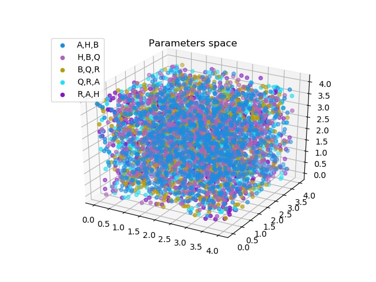

# SM 1D generator

The SM_generator_1d function is to generate a set of testing system models {A,B,H,Q,R}

The inputs of the function are: 

- num: the number of system models that we need to generate
- Arange, Brange, Hrange, Qrange, Rrange: the range of system models {A,B,H,Q,R}

The outputs of the function are:

- SM: $num$  number of system models {A,B,H,Q,R}

The run_example function is to run an example and visualize the parameters space.

In our example, we set:

- num = 1000
- Arang, Brange, Hrange, Qrange, Rrange to be: $0 \sim 4$

The visualization outcome is shown in the following figure:

