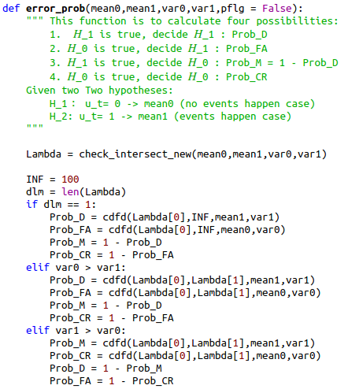
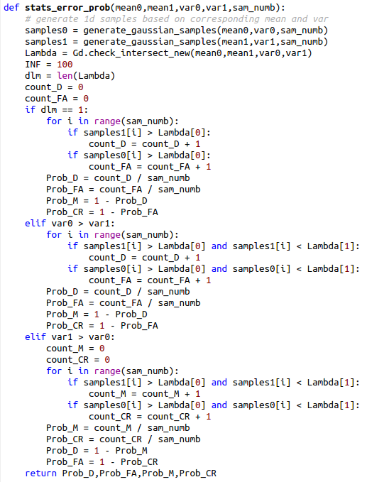
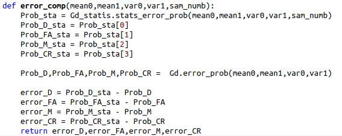
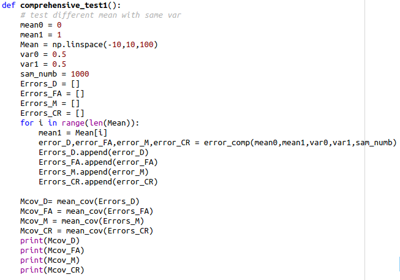
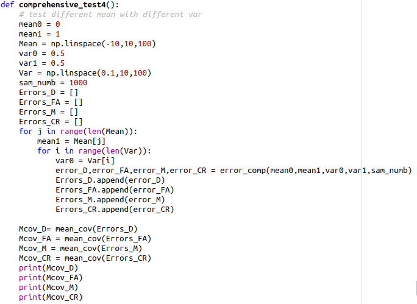

# Comprehensive testing on 1-d hypothesis testing

##　3 programs

* Error probability from equations
* Error probability from statistical analysis
* Error probability comparison

## Program 1

$$
u_t=\left\{
\begin{aligned}
H_0: 0 & (𝑛𝑜 𝑒𝑣𝑒𝑛𝑡𝑠 ℎ𝑎𝑝𝑝𝑒𝑛 𝑐𝑎𝑠𝑒)  \\
H_1: 1 & (𝑒𝑣𝑒𝑛𝑡𝑠 ℎ𝑎𝑝𝑝𝑒𝑛 𝑐𝑎𝑠𝑒) \\
\end{aligned}
\right.
$$

* $Prob\{decide H_1 |H_1 true\} =P_D = ∫ \limits_{D} N(HB∗1,σ^2)$ // latex words in Latex 

* $Prob\{decide H_1 |H_0 true\} =P_{FA} = \int \limits_{D} N(HB∗0,σ^2)$

* $Prob\{decide H_0│H_1 true\}=P_M=1-P_D$

* $Prob\{decide H_0│H_0 true\}=P_{CR}=1-P_{FA}$

  where, $D = \{f(HB∗1,σ^2) > f(HB∗0,σ^2)\}$

### Code implementation

## Program 2

Generate the 1000 1-d Gaussian sample points based on mean and variance.

Calculate how many sample points in the region that we decide $H_1$ when $H_1$ is true ($P_D$) and how many sample points the region we decide $H_1$ when $H_0$ is true ($P_{FA}$)

### Code implementation

Key function:

## Program 3

Compare the error probabilities $P_D,P_{FA},P_M,P_{CR}$ from theoretical equations (program 1) and statistical analysis (program 2). 

### Code implementation 

Key function:

### Comprehensive test

Comprehensive testing is to test the individual variables among variable space and calculate the mean and variance of those different sets of $error_D,error_{FA},error_M,error_{CR}$

#### Test1

Test different mean with the same variance:

$mean_0 = 0,mean_1 = \{-10 \sim 10\}, var_0 = 0.5, var_1 = 0.5$

Results:
mean and variance of $Prob_{xx}^{error} = Prob_{xx}^{program1} - Prob_{xx}^{program2}$ where, $xx:=\{D,FA,M,CR\}$

* $Mcov_D$ : (-0.0003748681682810921, 3.314628913936142e-05) // decimal number, these number is small enough 
* $Mcov_{FA}$ : (-8.486816828110765e-05, 4.022673908380263e-05)
* $Mcov_M$ : (0.0003748681682810928, 3.31462891393614e-05)
* $Mcov_{CR}$ : (8.486816828110921e-05, 4.022673908380266e-05)

#### Test2

Test same mean with different variance:

$mean_0 = 0,mean_1 = 1, var_0 = 0.5, var_1 = \{0.1 \sim 10\}$:

results:
* $ Mcov_D$ : (-0.0008905749604053736, 0.00024589468735123667)
* $Mcov_{FA}$ : (-0.0007043833596001342, 0.00010264520509596695)
* $ Mcov_M$ : (0.0008905749604053775, 0.00024589468735123645)
* $Mcov_{CR}$ : (0.0007043833596001348, 0.00010264520509596699)

#### Test3

Test same mean with different variance:

$mean_0 = 0,mean_1 = 1, var_0 = \{0.1 \sim 10\}, var_1 = 0.5$:

results:

* $ Mcov_D $ : (-0.0016985359860241113, 0.0001157542579612967)
* $ Mcov_{FA}$ : (0.0024901782600396725, 0.00024666998797030803)
* $Mcov_M$ : (0.0016985359860241106, 0.00011575425796129668)
* $ Mcov_{CR}$ : (-0.002490178260039676, 0.00024666998797030824)

#### Test4

Test different mean with different variance:

$mean_0 = 0,mean_1 = \{-10 \sim 10\}, var_0 = 0.5, var_1 = \{0.1 \sim 10\}$:

results:

* $ Mcov_D$ : (-0.00011546522147426655, 4.7334648939809933e-05)
* $ Mcov_{FA}$ : (0.00023444212600724917, 0.00016385530036082743)
* $ Mcov_M$ : (0.00011546522147426481, 4.7334648939809933e-05)
* $ Mcov_{CR}$ : (-0.00023444212600725215, 0.0001638553003608274)

