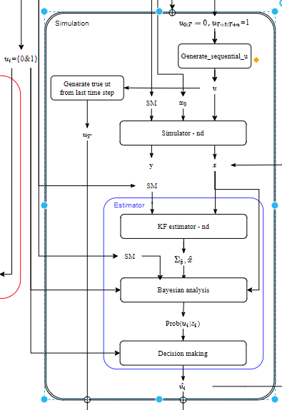

There are four programs in this folder:

- Generate_sequential_u.py
- Simulator.py
- Binary_stat_hypothesis_testing_1d.py

- Simulation.py

The structure of this estimator is shown in the following flowchart: 

In each programs, there are two main functions that we care about, one is the program function itself, the other is the verification program.

- The program function itself is the function to achieve all the functionality of this program.

- The verification program is to generate some support figures that would help verifying this function.

  The results from the verification are saved in the "*./figs/corresponding folders*"

  To run your own verification proof, you can go to the corresponding program and run "*verification(num)*", *num* here is to specify how many numbers of trials that you want to run. 

