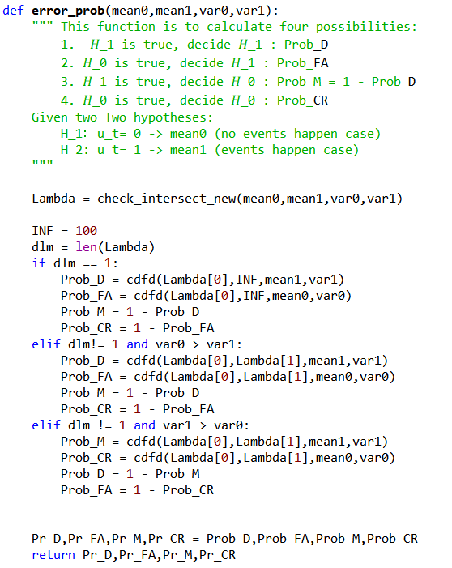

# Different tests for error probability program 

## Recall

$$
u_t=\left\{
\begin{aligned}
H_0: 0 & (𝑛𝑜 𝑒𝑣𝑒𝑛𝑡𝑠 ℎ𝑎𝑝𝑝𝑒𝑛 𝑐𝑎𝑠𝑒)  \\
H_1: 1 & (𝑒𝑣𝑒𝑛𝑡𝑠 ℎ𝑎𝑝𝑝𝑒𝑛 𝑐𝑎𝑠𝑒) \\
\end{aligned}
\right.
$$

* $Prob\{decide H_1 |H_1 true\} =P_D = ∫_λ^∝ N(HB∗1,σ^2)$

* $Prob\{decide H_1 |H_0 true\} =P_{FA} = ∫_λ^∝ N(HB∗0,σ^2)$

* $Prob\{decide H_0│H_1 true\}=P_M=1-P_D$

* $Prob\{decide H_0│H_0 true\}=P_{CR}=1-P_{FA}$

## Code implementation

## Cases test

#### Case1:

#### Case2:

#### Case3:

#### Case4:

#### Case5:

#### Case6:

#### Case7:

