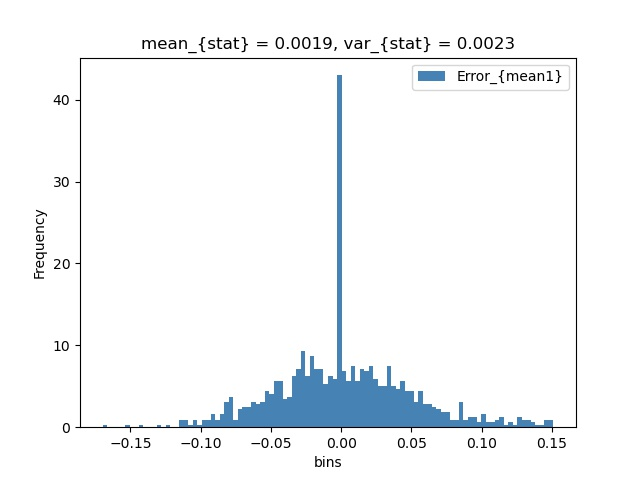
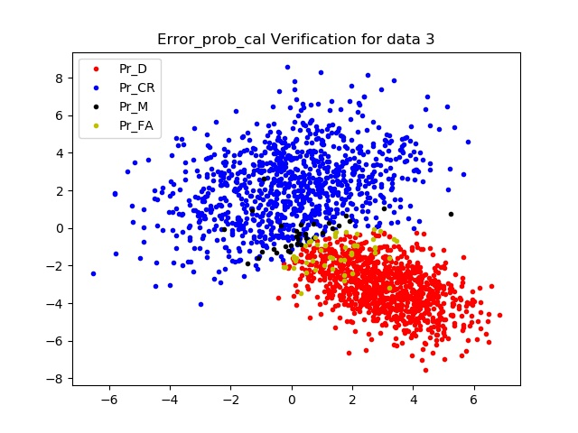

# Binary_HT_nd README

### Overview 

This folder contains three main programs:

- bin_HT_nd
- sampling_binGDnd
- Error_prob_cal

The flowchart of these program is shown as follow:

### Sampling_binGDnd 

This program is to sample points from probability distribution for n-dimensional space. 

There are three sub-programs about it:

- sampling_binGDnd

- sampling_binGDnd_verification

  - In the **sampling_binGDnd_verification** program, you can run different numbers of trials by changing the *trial_num* parameters. 
  - The generated data will be saved in the "*data_storage*" folder once the **sampling_binGDnd_verification** program finish running 

- sampling_binGDnd_Plot

  - In the **sampling_binGDnd_Plot** program, we can load the saved data into the program and decide which results of trials that we want to plot. 

  - The plotting results will be saved in the *figs* folder. 

  - The statistical comparison results from $Pr_D,Pr_M,Pr_FA,Pr_CR$

    

    

    

    

### Error_prob_cal

This program is to calculate the error probabilities based on sample points.

There are two sub-programs about it:

- Error_prob_cal

- Error_prob_cal_verification

  - In this program, we could verify 2d error probabilities 

  - It can also save the figures what we select or all the figures into the *figs/error_prob_verification_2d* folder

  - Some results:

    

    

